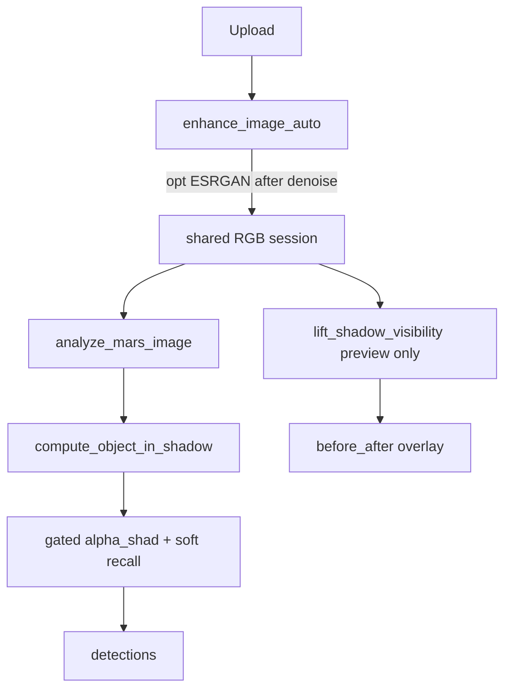

# Shadow Dual-Track + ESRGAN Implementation Plan

> **For agentic workers:** Use subagent-driven-development or executing-plans task-by-task. Steps use checkboxes in the saved plan file after approval.

**Goal:** Kaya dibi gölgelerde görünürlük (Track A) ve analiz recall (Track B) ayrı mantıkla; opsiyonel Real-ESRGAN daha güvenli/etkili sırayla paylaşılan Mars-safe enhance’te.

**Architecture:** Tek Shared RGB (`enhance_image_auto` → `enhanced_image_for_analysis`). Track A = maske-guided gamma→CLAHE preview (session’a yazılmaz). Track B = `object_in_shadow` gate ile koşullu `alpha_shad` + lokal soft recall. ESRGAN: denoise → SR → cubic → CLAHE → gamma → unsharp; CUDA `half=True`.

**Tech stack:** OpenCV, NumPy, mevcut DPT depth, Real-ESRGAN (`raw_models/RealESRGAN_x2plus.pth`), Streamlit, pytest.

**Locked decisions (brainstorm):** C hedefler / mimari 2 (tek RGB) / ESRGAN B / gölge C (A default + depth opsiyonel) / yaklaşım 1 (lean).

---

## File map

| File | Responsibility |
|------|----------------|
| `docs/superpowers/specs/2026-07-20-shadow-dual-track-enhance-design.md` | Onaylı tasarım kaydı |
| `docs/superpowers/plans/2026-07-20-shadow-dual-track-enhance.md` | Bu planın checkbox’lı kopyası |
| [`src/core/false_positive_masks.py`](src/core/false_positive_masks.py) | `compute_object_in_shadow`, gated suppression helper; edge helper reuse |
| [`src/utils/shadow_visibility.py`](src/utils/shadow_visibility.py) **(yeni)** | Track A: `lift_shadow_visibility(rgb, depth=None, use_depth_gate=False)` |
| [`src/utils/image_enhancement.py`](src/utils/image_enhancement.py) | ESRGAN sırası + `half=torch.cuda.is_available()` |
| [`src/ui/enhance_panel.py`](src/ui/enhance_panel.py) | Track A checkbox’lar + before/after; Shared RGB dokunulmaz |
| [`app.py`](app.py) | Track B: fusion’da gated alpha; sidebar `beta_shadow_obj`; preview bağlama |
| [`src/ui/i18n/tr.py`](src/ui/i18n/tr.py), [`en.py`](src/ui/i18n/en.py) | Yeni stringler |
| `tests/test_shadow_visibility.py` | Track A |
| `tests/test_object_in_shadow_gate.py` | Track B |
| `tests/test_mars_image_enhancement.py` | ESRGAN sıra / half smoke |



---

## Task 0: Spec + plan files on branch

- Branch: `feat/shadow-dual-track-enhance` from `main`
- Write design spec (sections 1–5 as approved) + this plan under `docs/superpowers/`
- Commit: `docs: shadow dual-track design and plan`

---

## Task 1: Track A — failing tests then `lift_shadow_visibility`

**Test** `tests/test_shadow_visibility.py`:
- Synthetic dark ROI + bright flat: after lift, dark ROI mean ↑; bright ROI mean within ~5% of original
- `use_depth_gate=True` with high depth_edge in dark ROI: mask weaker there than flat dark
- Return shape/dtype uint8 RGB same size

**Impl** [`src/utils/shadow_visibility.py`](src/utils/shadow_visibility.py):
- Mask: reuse `_image_depth_edges` / dark formula from FP module (export small helpers or import `compute_shadow_like` when depth given; RGB-only path when `depth is None`)
- Lift: masked gamma toward ~120 + CLAHE clip 1.5; `out = orig*(1-m) + lifted*m`
- No write to analysis session

**Verify:** `pytest tests/test_shadow_visibility.py -v` → PASS

---

## Task 2: Track B — `compute_object_in_shadow` + gated suppression

**Test** `tests/test_object_in_shadow_gate.py`:
- Flat dark + low edges → gate ≈ 0; dark + high image/depth edge → gate high
- `apply` helper: with `beta=1`, gated region suppression < ungated flat shadow for same `alpha_shad`

**Impl** in [`false_positive_masks.py`](src/core/false_positive_masks.py):
```python
# object_gate = shadow_like * clip(max(image_edge, depth_edge), 0, 1)
# alpha_map = alpha_shad * (1 - beta * object_gate)
# combined *= (1 - alpha_map * shadow_like)  # or equivalent soft form
# optional: combined += gamma_recall * object_gate * local_anomaly_hint  # keep gamma small, default 0.05–0.1
```

**Wire** [`app.py`](app.py) `compute_combined_anomaly_map` (~1652–1690): replace raw `alpha_shad * shadow_like` with gated helper; sidebar slider `beta_shadow_obj` default `0.5`.

**Verify:** `pytest tests/test_object_in_shadow_gate.py tests/test_false_positive_masks.py -v`

---

## Task 3: ESRGAN order + half

**Test:** extend [`tests/test_mars_image_enhancement.py`](tests/test_mars_image_enhancement.py):
- Monkeypatch `_upscale_realesrgan` / `_denoise` to record call order when `enable_realesrgan=True` and forced denoise path → assert denoise before SR (or: when noise high synthetic, steps list order `denoise` before `realesrgan`)
- Upscale-only path: if no denoise, SR still before CLAHE in `steps`

**Impl** [`image_enhancement.py`](src/utils/image_enhancement.py):
1. Optional denoise (if enabled & noisy)
2. If upscale needed & ESRGAN: SR then cubic to target
3. Else cubic as today
4. AWB / CLAHE / gamma / unsharp unchanged
5. `_get_realesrgan_upsampler`: `half=torch.cuda.is_available()`; OOM → catch, set fallback, retry tile smaller once (200) then None

**Verify:** `pytest tests/test_mars_image_enhancement.py -v`

---

## Task 4: UI (Track A preview + i18n)

[`enhance_panel.py`](src/ui/enhance_panel.py):
- After Shared enhance, optional “Shadow visibility preview” checkbox (default on for display only)
- Optional “Depth-gate shadow mask” (default off; needs depth from session or skip with caption)
- Show columns: Shared | Lifted | Mask overlay
- **Do not** assign lifted image to `enhanced_image_for_analysis`

[`app.py`](app.py): if analysis results exist, optional reuse `lift_shadow_visibility` on focus tiles for human QC only.

i18n TR/EN keys for new controls + ESRGAN “runs after denoise” help text.

**Verify:** i18n key parity test if present; manual Streamlit smoke checklist below.

---

## Task 5: Full verification gate (“tam kontrol”)

Run in order; fail = stop and fix:

1. `pytest tests/test_shadow_visibility.py tests/test_object_in_shadow_gate.py tests/test_mars_image_enhancement.py tests/test_false_positive_masks.py -v`
2. Existing related: `pytest tests/test_object_score_fusion.py tests/test_rocky_boulder_proposals.py -q` (shadow_cut callers)
3. `& "$env:USERPROFILE\.local\bin\graphify.exe" update .`
4. Manual Streamlit (local):
   - Enhance without ESRGAN → Shared unchanged by Track A toggle
   - Track A: kaya dibi daha okunaklı; analiz aynı skor tabanı (A off/on karşılaştırması)
   - Track B: `beta_shadow_obj=0` ≈ eski davranış; `0.5–1.0` gölgede kenarlı bölgede recall artışı, düz gölgede FP sınırlı
   - ESRGAN on + weight present: steps denoise→realesrgan; OOM/missing → fallback flag
5. Commit(s) on feature branch; push; PR → `main`; merge after green

---

## Out of scope (do not build)

DL shadow removal, Silva full port, LiDAR/HSI, ROI-only ESRGAN, GFPGAN, ikinci analiz RGB kopyası.

---

## Skipped (ponytail)

- Custom shadow DL / NTIRE models — add when Mars labeled shadow GT exists
- Separate analysis enhance branch — mimari 2 bilinçli reddetti
